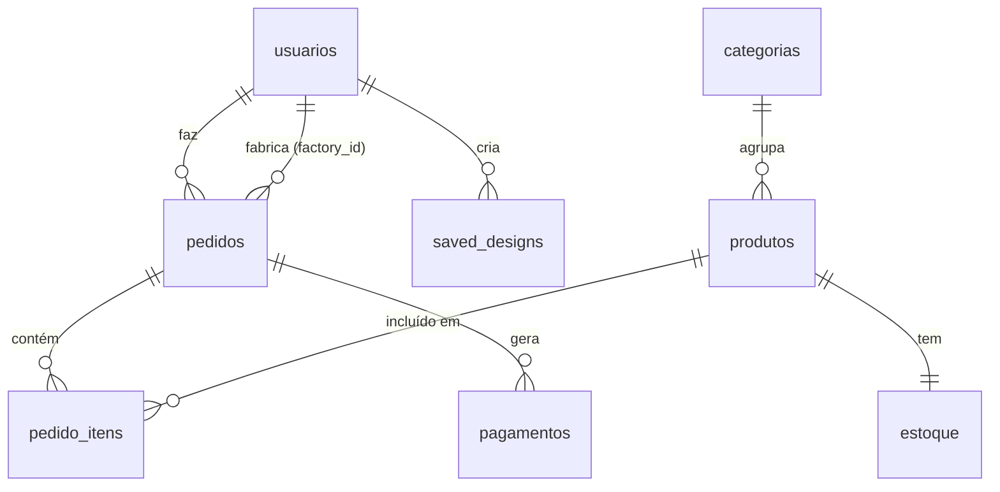

<


---

## 📑 Índice

- [Visão Geral](#-visão-geral)
- [Stack Tecnológico](#-stack-tecnológico)
- [Arquitetura](#-arquitetura)
- [Primeiros Passos](#-primeiros-passos)
- [Variáveis de Ambiente](#-variáveis-de-ambiente)
- [Frontend](#-frontend)
- [Backend](#-backend)
- [API Reference](#-api-reference)
- [Banco de Dados](#-banco-de-dados)
- [Autenticação e Autorização](#-autenticação-e-autorização)
- [Sistema de Pagamentos](#-sistema-de-pagamentos)
- [Motor 3D](#-motor-3d)
- [AR Try-On](#-ar-try-on)
- [Segurança](#-segurança)
- [Deploy](#-deploy)
- [Scripts Disponíveis](#-scripts-disponíveis)

---

## 🌐 Visão Geral

O Opticus é uma plataforma de eyewear que permite aos usuários:

- **Customizar óculos em 3D** — Escolher silhueta, materiais, cores, tratamentos de lente e componentes
- **Experimentar via AR** — Usar a webcam para ver como o óculos fica no rosto com MediaPipe
- **Comprar com Pix** — Checkout integrado com AbacatePay para pagamento instantâneo
- **Gerenciar produção** — Dashboards para fábricas e staff com gráficos e controle de pedidos
- **Funcionar offline** — Modo fallback com localStorage quando o backend está indisponível

### Papéis de Usuário

| Papel | Permissões |
|-------|-----------|
| **Client** | Criar/salvar designs, adicionar ao carrinho, fazer pedidos, ver próprios pedidos |
| **Factory** | Ver pedidos atribuídos, atualizar status de produção, ver estoque |
| **Staff** | Acesso total: gerenciar usuários, produtos, categorias, estoque, ver todos os pedidos e pagamentos |

---

## 🛠 Stack Tecnológico

### Frontend
| Tecnologia | Versão | Uso |
|-----------|--------|-----|
| React | 19.2 | Framework UI |
| Vite | 8.x | Build tool & dev server |
| React Router DOM | 7.15 | Roteamento SPA |
| Three.js | 0.184 | Renderização 3D (WebGL) |
| MediaPipe | 0.10.35 | Face tracking para AR try-on |
| Recharts | 3.8 | Gráficos dos dashboards |
| Lucide React | 1.16 | Biblioteca de ícones |

### Backend
| Tecnologia | Versão | Uso |
|-----------|--------|-----|
| Express.js | 4.19 | Framework HTTP |
| PostgreSQL (pg) | 8.21 | Banco de dados relacional |
| JSON Web Token | 9.0 | Autenticação stateless |
| bcryptjs | 2.4 | Hash de senhas |
| Helmet | 8.2 | Headers de segurança HTTP |
| Pino | 10.3 | Logging estruturado (JSON) |
| Nodemailer | 8.0 | Notificações por email |

### Fontes
- **Outfit** (300–700) — Texto geral, UI
- **Playfair Display** (400/600/700, italic) — Títulos decorativos

---

## 🏗 Arquitetura

```
┌─────────────────────────────────────────────────────────┐
│                    FRONTEND (Vite + React)               │
│                   Vercel / localhost:5173                 │
│                                                         │
│  ┌──────────┐  ┌──────────┐  ┌──────────┐  ┌─────────┐ │
│  │Marketplace│  │Creator   │  │  Cart &  │  │Dashboard│ │
│  │  & Shop   │  │ Studio   │  │ Checkout │  │ Factory │ │
│  │          │  │ (Three.js)│  │          │  │ & Staff │ │
│  └──────────┘  └──────────┘  └──────────┘  └─────────┘ │
│       │              │             │             │       │
│  ┌────┴──────────────┴─────────────┴─────────────┘      │
│  │  Contexts: Auth | Cart | Order | Language | Creator  │
│  └──────────────────────┬───────────────────────────────┘
│                         │ VITE_API_URL                   │
└─────────────────────────┼───────────────────────────────┘
                          │ HTTPS
┌─────────────────────────┼───────────────────────────────┐
│                    BACKEND (Express.js)                   │
│                   Render / localhost:5000                 │
│                                                         │
│  ┌─────────┐  ┌─────────┐  ┌─────────┐  ┌───────────┐ │
│  │  Auth   │  │ Orders  │  │Payments │  │ Products  │ │
│  │Controller│ │Controller│ │Controller│ │ & Stock   │ │
│  └────┬────┘  └────┬────┘  └────┬────┘  └─────┬─────┘ │
│       └────────────┴────────────┴──────────────┘        │
│                         │                                │
│              ┌──────────┴──────────┐                     │
│              │   PostgreSQL (pg)   │                     │
│              │    Supabase / Local │                     │
│              └─────────────────────┘                     │
└─────────────────────────────────────────────────────────┘
                          │
              ┌───────────┴───────────┐
              │     AbacatePay API    │
              │  (Pix Payment Gateway)│
              └───────────────────────┘
```

### Modo Offline (Fallback)

O frontend opera em **dual mode**. Se o backend estiver indisponível:
- Login/signup usa dados em `localStorage`
- Pedidos são enfileirados localmente
- Designs são salvos no navegador
- Checkout simula o pagamento

---

## 🚀 Primeiros Passos

### Pré-requisitos

- **Node.js** ≥ 18.0.0
- **PostgreSQL** 14+ (ou conta Supabase)
- **npm** ou **yarn**

### Instalação

```bash
# 1. Clonar o repositório
git clone https://github.com/EZLBR/Di-Poly-Opticus.git
cd Di-Poly-Opticus

# 2. Instalar dependências do frontend
npm install

# 3. Instalar dependências do backend
cd server
npm install

# 4. Configurar variáveis de ambiente
cp .env.example .env
# Edite o .env com suas credenciais (ver seção abaixo)

# 5. Inicializar o banco de dados (automático no primeiro start)
npm start

# 6. Em outro terminal, iniciar o frontend
cd ..
npm run dev
```

O frontend estará em `http://localhost:5173` e o backend em `http://localhost:5000`.

### Usuários Demo (criados automaticamente)

| Email | Senha | Papel |
|-------|-------|-------|
| `client@opticus.com` | `123456` | Client |
| `factory@opticus.com` | `123456` | Factory |
| `staff@opticus.com` | `123456` | Staff |

---

## 🔐 Variáveis de Ambiente

### Frontend (`/.env`)

| Variável | Padrão | Descrição |
|----------|--------|-----------|
| `VITE_API_URL` | `http://localhost:5000/api` | URL base da API do backend |

### Backend (`/server/.env`)

| Variável | Padrão | Obrigatório | Descrição |
|----------|--------|-------------|-----------|
| `DATABASE_URL` | — | Sim* | Connection string PostgreSQL (prioridade sobre vars individuais) |
| `DB_HOST` | `localhost` | — | Host do banco |
| `DB_PORT` | `5432` | — | Porta do banco |
| `DB_USER` | `postgres` | — | Usuário do banco |
| `DB_PASSWORD` | `postgres` | — | Senha do banco |
| `DB_NAME` | `opticus_db` | — | Nome do banco |
| `DB_SSL` | — | — | `"true"` para forçar SSL |
| `JWT_SECRET` | — | **Sim** | Segredo para assinar tokens JWT (o servidor **não inicia** sem isso) |
| `ABACATE_TOKEN` | — | Não | Token da API AbacatePay. Se vazio, usa simulador de pagamento |
| `PORT` | `5000` | — | Porta do servidor Express |
| `FRONTEND_URL` | `http://localhost:5173` | — | URL do frontend (CORS + redirects) |
| `NODE_ENV` | — | — | `production` para logs JSON, senão pretty-print |

> **\*** Use `DATABASE_URL` **ou** as variáveis `DB_*` individuais. Se `DATABASE_URL` estiver definida, as outras são ignoradas.

---

## 💻 Frontend

### Estrutura de Arquivos

```
src/
├── main.jsx                          # Entry point + Context providers
├── App.jsx                           # Router + layout + payment success modal
├── index.css                         # Design system completo (~4400 linhas)
│
├── contexts/
│   ├── AuthContext.jsx               # Auth state, login/signup, user CRUD
│   ├── CartContext.jsx               # Cart state, checkout flow
│   ├── OrderContext.jsx              # Orders state, status updates, billing
│   ├── LanguageContext.jsx           # i18n (PT-BR / EN), ~90 translation keys
│   └── CreatorStudioContext.jsx      # 30+ customization state values
│
├── components/
│   ├── Navbar.jsx                    # Navigation, dark mode, language, cart badge
│   ├── Marketplace.jsx               # Landing page + product catalog
│   ├── CreatorStudio.jsx             # 3D studio page wrapper
│   ├── DesignsGallery.jsx            # Saved designs grid
│   ├── AuthPage.jsx                  # Login/signup forms
│   ├── Cart.jsx                      # Shopping cart + checkout
│   ├── Dashboards.jsx                # FactoryDashboard + StaffDashboard
│   ├── ErrorBoundary.jsx             # Error catch UI
│   ├── ThreePreview.jsx              # Thumbnail 3D preview (cards)
│   │
│   └── creator/
│       ├── ThreePreview.jsx          # Full 3D studio viewport (611 linhas)
│       ├── CustomizationPanel.jsx    # Configuration panel (3 tabs)
│       ├── TryOnViewport.jsx         # AR webcam try-on (MediaPipe)
│       └── CreatorModals.jsx         # Save design modal
│
└── utils/
    └── pricing.js                    # Price calculation logic
```

### Roteamento

| Rota | Componente | Lazy Load | Acesso |
|------|-----------|-----------|--------|
| `/` | `Marketplace` | ✅ | Público |
| `/create` | `CreatorStudio` | ✅ | Público |
| `/designs` | `DesignsGallery` | ✅ | Requer login |
| `/cart` | `Cart` | ✅ | Público |
| `/login` | `AuthPage` | ✅ | Público |
| `/factory-dashboard` | `FactoryDashboard` | ❌ | Apenas `factory` |
| `/staff-dashboard` | `StaffDashboard` | ❌ | Apenas `staff` |

### Context Providers (ordem de aninhamento)

```jsx
<StrictMode>
  <AuthProvider>        {/* Auth state, backend connectivity */}
    <OrderProvider>     {/* Orders, status updates */}
      <CartProvider>    {/* Cart items, checkout */}
        <LanguageProvider> {/* i18n */}
          <Router>
            <App />
          </Router>
        </LanguageProvider>
      </CartProvider>
    </OrderProvider>
  </AuthProvider>
</StrictMode>
```

### Precificação (`utils/pricing.js`)

| Componente | Adição ao Preço |
|-----------|----------------|
| Preço base | $180 |
| Lentes solares | +$40 |
| Perfil Bold | +$20 |
| Cada tratamento de lente | +$15 |
| Material premium (titanium, gold, carbon fiber) | +$80 |
| Lente policarbonato | +$30 |

### LocalStorage Keys

| Chave | Tipo | Descrição |
|-------|------|-----------|
| `opticus_token` | string | JWT de autenticação |
| `opticus_session` | JSON | Dados do usuário logado |
| `opticus_users` | JSON[] | Usuários (modo offline) |
| `opticus_designs` | JSON[] | Designs salvos (modo offline) |
| `opticus_cart` | JSON[] | Itens do carrinho |
| `opticus_orders` | JSON[] | Pedidos (modo offline) |
| `opticus_favorites` | JSON[] | Produtos favoritados |
| `opticus_theme` | string | `"dark"` ou `"light"` |
| `opticus_language` | string | `"pt"` ou `"en"` |
| `opticus_creator_draft` | JSON | Autosave do Creator Studio |
| `opticus_active_design` | number | Índice do design em edição |
| `opticus_redirect_after_login` | string | Rota para redirecionar após login |

---

## ⚙️ Backend

### Estrutura de Arquivos

```
server/
├── server.js                 # Express entry point, middleware chain
├── package.json
├── .env                      # Variáveis de ambiente (não versionado)
├── .env.example              # Template de configuração
│
├── config/
│   └── db.js                 # PostgreSQL pool, schema DDL, seeds
│
├── controllers/
│   ├── authController.js     # Register, login, getMe, user CRUD
│   ├── orderController.js    # Create order, checkout cart, get orders, update status
│   ├── paymentController.js  # AbacatePay billing, webhook, simulated checkout
│   ├── designController.js   # Save/get/delete saved designs
│   ├── productController.js  # Product CRUD (soft delete)
│   ├── categoryController.js # Category CRUD with product count
│   └── stockController.js    # Stock management (set/add/subtract)
│
├── routes/
│   ├── authRoutes.js
│   ├── orderRoutes.js
│   ├── paymentRoutes.js
│   ├── designRoutes.js
│   ├── productRoutes.js
│   ├── categoryRoutes.js
│   └── stockRoutes.js
│
├── middleware/
│   └── auth.js               # JWT protect + role authorize
│
├── utils/
│   ├── logger.js             # Pino structured logger
│   └── emailService.js       # Ethereal SMTP for order notifications
│
└── scripts/
    └── migrate.js            # SQL file-based migration runner
```

### Cadeia de Middleware (ordem de execução)

1. **CORS** — Permite todas as origens (credentials habilitado)
2. **Helmet** — Headers de segurança (CSP desabilitado para compatibilidade)
3. **XSS-Clean** — Sanitização contra XSS no body/query/params
4. **Rate Limit (login)** — `/api/auth/login`: 15 requests / 15 min por IP
5. **Rate Limit (geral)** — `/api/*`: 100 requests / 15 min por IP
6. **Body Parser** — JSON e URL-encoded com limite de 1MB
7. **Request Logger** — Loga `METHOD URL` via Pino

---

## 📡 API Reference

**Base URL:** `http://localhost:5000/api`

### Health Check

```
GET /health → { success: true, status: "Server is healthy and responsive." }
```

---

### 🔑 Auth (`/api/auth`)

#### `POST /api/auth/register`
Registra um novo usuário (sempre com role `client`).

```json
// Request
{ "name": "João", "email": "joao@email.com", "password": "minhasenha123" }

// Response 201
{ "success": true, "token": "eyJhb...", "user": { "id": 1, "name": "João", "email": "joao@email.com", "role": "client" } }
```

**Validações:** Email com formato válido, senha ≥ 8 chars com letras E números, email único.

#### `POST /api/auth/login` ⚡ Rate limited: 15/15min
```json
// Request
{ "email": "client@opticus.com", "password": "123456" }

// Response 200
{ "success": true, "token": "eyJhb...", "user": { "id": 1, "name": "Cliente Demo", "email": "client@opticus.com", "role": "client" } }
```

#### `GET /api/auth/me` 🔒
Retorna perfil do usuário autenticado.

#### `GET /api/auth/users` 🔒 Staff only
Lista todos os usuários com paginação. Query: `?page=1&limit=20`

#### `PUT /api/auth/users/:id` 🔒 Staff only
Atualiza `name` e/ou `factoryName` de um usuário.

#### `DELETE /api/auth/users/:id` 🔒 Staff only
Remove um usuário.

---

### 📦 Orders (`/api/orders`) 🔒 Todas protegidas

#### `POST /api/orders`
Cria pedido individual.

```json
// Request
{ "productName": "Custom Aviator", "factoryId": 2, "factoryName": "Fábrica Alpha", "total": 250.00, "customSpecs": "{...}" }

// Response 201
{ "success": true, "order": { "id": 1, "status": "Pending Payment", ... } }
```

#### `POST /api/orders/checkout-cart`
Checkout do carrinho inteiro. Cria múltiplos pedidos em transação e gera billing AbacatePay.

```json
// Request
{ "cartItems": [{ "productName": "...", "total": 250, "quantity": 1, "customSpecs": "{...}" }] }

// Response 200
{ "success": true, "checkoutUrl": "https://...", "isSimulated": false, "billingId": "bill_abc123" }
```

#### `GET /api/orders`
Lista pedidos filtrados por papel:
- **Client:** vê apenas seus pedidos
- **Factory:** vê pedidos atribuídos à sua fábrica
- **Staff:** vê todos

Query: `?page=1&limit=20`

#### `PUT /api/orders/:id/status` 🔒 Factory/Staff
Atualiza status do pedido. Valores válidos: `Queued`, `In production`, `Delivered`, `Pending Payment`, `Cancelled`.

---

### 💳 Payments (`/api/payments`)

#### `POST /api/payments/create-billing` 🔒
Cria billing no AbacatePay ou redireciona para simulador.

#### `GET /api/payments` 🔒 Staff only
Lista todos os pagamentos com paginação.

#### `POST /api/payments/webhook`
Webhook do AbacatePay. Valida assinatura HMAC-SHA256. No evento `billing.paid`: atualiza pedido para `Queued` e pagamento para `aprovado`.

#### `GET /api/payments/simulated-checkout`
Renderiza página HTML de checkout simulado (quando `ABACATE_TOKEN` não está configurado).

#### `POST /api/payments/confirm-simulated-payment`
Confirma pagamento simulado e redireciona para o frontend.

---

### 🎨 Designs (`/api/designs`) 🔒 Todas protegidas

#### `POST /api/designs`
Salva ou atualiza design (upsert por `id` + `email`).

#### `GET /api/designs`
Lista designs do usuário autenticado.

#### `DELETE /api/designs/:id`
Remove design (verificação de propriedade por email).

---

### 🏷️ Products (`/api/products`)

| Método | Rota | Auth | Descrição |
|--------|------|------|-----------|
| `GET` | `/api/products` | ❌ | Listar produtos ativos (filtro por categoria, busca, paginação) |
| `GET` | `/api/products/:id` | ❌ | Detalhes do produto com estoque |
| `POST` | `/api/products` | 🔒 Staff | Criar produto |
| `PUT` | `/api/products/:id` | 🔒 Staff | Atualizar produto |
| `DELETE` | `/api/products/:id` | 🔒 Staff | Soft delete (desativa) |

---

### 📂 Categories (`/api/categories`)

| Método | Rota | Auth | Descrição |
|--------|------|------|-----------|
| `GET` | `/api/categories` | ❌ | Listar com contagem de produtos |
| `GET` | `/api/categories/:id` | ❌ | Detalhes com produtos da categoria |
| `POST` | `/api/categories` | 🔒 Staff | Criar (verifica duplicata) |
| `PUT` | `/api/categories/:id` | 🔒 Staff | Atualizar |
| `DELETE` | `/api/categories/:id` | 🔒 Staff | Deletar (bloqueado se tem produtos ativos) |

---

### 📊 Stock (`/api/stock`) 🔒 Staff/Factory

| Método | Rota | Auth | Descrição |
|--------|------|------|-----------|
| `GET` | `/api/stock` | 🔒 Staff/Factory | Listar todo estoque com alertas |
| `GET` | `/api/stock/alerts` | 🔒 Staff/Factory | Produtos abaixo do estoque mínimo |
| `GET` | `/api/stock/product/:id` | 🔒 Staff/Factory | Estoque de um produto |
| `PUT` | `/api/stock/product/:id` | 🔒 Staff | Atualizar (`operacao`: `set`, `add`, `subtract`) |

---

## 🗄 Banco de Dados

### Diagrama ER



### Tabelas

#### `usuarios`
| Coluna | Tipo | Restrições |
|--------|------|-----------|
| `id` | SERIAL | PK |
| `nome` | VARCHAR(255) | NOT NULL |
| `email` | VARCHAR(255) | UNIQUE NOT NULL |
| `senha_hash` | VARCHAR(255) | NOT NULL |
| `role` | VARCHAR(50) | DEFAULT 'client', CHECK ('client','factory','staff') |
| `factory_name` | VARCHAR(255) | — |
| `criado_em` | TIMESTAMP | DEFAULT CURRENT_TIMESTAMP |

#### `pedidos`
| Coluna | Tipo | Restrições |
|--------|------|-----------|
| `id` | SERIAL | PK |
| `usuario_id` | INT | FK → usuarios, NOT NULL |
| `customer_name` | VARCHAR(255) | NOT NULL |
| `customer_email` | VARCHAR(255) | NOT NULL |
| `product_name` | VARCHAR(255) | NOT NULL |
| `factory_id` | INT | FK → usuarios |
| `factory_name` | VARCHAR(255) | — |
| `status` | VARCHAR(50) | DEFAULT 'Pending Payment' |
| `total` | DECIMAL(10,2) | NOT NULL |
| `custom_specs` | TEXT | JSON string |
| `abacate_billing_id` | VARCHAR(255) | — |
| `criado_em` | TIMESTAMP | DEFAULT CURRENT_TIMESTAMP |
| `atualizado_em` | TIMESTAMP | DEFAULT CURRENT_TIMESTAMP |

**Status válidos:** `Pending Payment` → `Queued` → `In production` → `Delivered` | `Cancelled`

#### `pagamentos`
| Coluna | Tipo | Restrições |
|--------|------|-----------|
| `id` | SERIAL | PK |
| `pedido_id` | INT | FK → pedidos, NOT NULL |
| `metodo` | VARCHAR(50) | DEFAULT 'pix' |
| `status` | VARCHAR(50) | DEFAULT 'pendente' |
| `valor` | DECIMAL(10,2) | NOT NULL |
| `referencia_externa` | VARCHAR(255) | — |

#### `produtos`
| Coluna | Tipo | Restrições |
|--------|------|-----------|
| `id` | SERIAL | PK |
| `nome` | VARCHAR(255) | NOT NULL |
| `descricao` | TEXT | — |
| `preco` | DECIMAL(10,2) | NOT NULL |
| `categoria_id` | INT | FK → categorias |
| `imagem_url` | VARCHAR(500) | — |
| `ativo` | BOOLEAN | DEFAULT TRUE |

#### `categorias`
| Coluna | Tipo | Restrições |
|--------|------|-----------|
| `id` | SERIAL | PK |
| `nome` | VARCHAR(100) | NOT NULL |
| `descricao` | TEXT | — |

#### `estoque`
| Coluna | Tipo | Restrições |
|--------|------|-----------|
| `id` | SERIAL | PK |
| `produto_id` | INT | FK → produtos, UNIQUE NOT NULL |
| `quantidade` | INT | NOT NULL DEFAULT 0 |
| `estoque_minimo` | INT | DEFAULT 5 |

#### `pedido_itens`
| Coluna | Tipo | Restrições |
|--------|------|-----------|
| `id` | SERIAL | PK |
| `pedido_id` | INT | FK → pedidos, NOT NULL |
| `produto_id` | INT | FK → produtos, NOT NULL |
| `quantidade` | INT | NOT NULL DEFAULT 1 |
| `preco_unitario` | DECIMAL(10,2) | NOT NULL |

#### `saved_designs`
| Coluna | Tipo | Restrições |
|--------|------|-----------|
| `id` | VARCHAR(255) | PK |
| `usuario_id` | INT | FK → usuarios, NOT NULL |
| `customer_email` | VARCHAR(255) | NOT NULL |
| `name` | VARCHAR(255) | NOT NULL |
| `model` | VARCHAR(255) | NOT NULL |
| `color` | VARCHAR(50) | NOT NULL |
| `is_sunglasses` | BOOLEAN | DEFAULT FALSE |
| `anti_reflective` | BOOLEAN | DEFAULT FALSE |
| `temple_style` | VARCHAR(50) | DEFAULT 'standard' |
| `frame_profile` | VARCHAR(50) | DEFAULT 'medium' |
| `published` | BOOLEAN | DEFAULT FALSE |

### Índices

| Tabela | Coluna | Nome do Índice |
|--------|--------|---------------|
| `produtos` | `categoria_id` | `idx_produtos_categoria` |
| `pedidos` | `usuario_id` | `idx_pedidos_usuario` |
| `pedidos` | `factory_id` | `idx_pedidos_factory` |
| `pedidos` | `status` | `idx_pedidos_status` |
| `pedidos` | `abacate_billing_id` | `idx_pedidos_billing` |
| `pedido_itens` | `pedido_id` | `idx_itens_pedido` |
| `pedido_itens` | `produto_id` | `idx_itens_produto` |
| `pagamentos` | `pedido_id` | `idx_pagamentos_pedido` |
| `saved_designs` | `usuario_id` | `idx_designs_usuario` |
| `saved_designs` | `customer_email` | `idx_designs_email` |

### Dados Seed (inseridos automaticamente quando o banco está vazio)

- 3 usuários demo (client, factory, staff)
- 4 categorias (Óculos de Sol, Armações, Lentes, Acessórios)
- 2 produtos com estoque (Model Aurora R$450, Model Vertex R$320)

---

## 🔑 Autenticação e Autorização

### Fluxo de Autenticação

1. Usuário faz `POST /api/auth/login` com email e senha
2. Backend verifica hash bcrypt (10 salt rounds)
3. Retorna JWT com payload: `{ id, email, name, role, factoryName }`, expira em **7 dias**
4. Frontend armazena token em `localStorage` e envia como `Authorization: Bearer <token>`

### Middleware de Proteção

```
protect(req, res, next)
├── Extrai token do header Authorization
├── Verifica JWT com JWT_SECRET
├── Decodifica payload → req.user
└── Retorna 401 se inválido

authorize(...roles)
├── Verifica req.user.role ∈ roles
└── Retorna 403 se não autorizado
```

### Controle de Acesso por Endpoint

| Recurso | Client | Factory | Staff |
|---------|--------|---------|-------|
| Ver próprios pedidos | ✅ | ✅ | ✅ |
| Ver todos os pedidos | ❌ | ❌ | ✅ |
| Atualizar status | ❌ | ✅ (próprios) | ✅ |
| Gerenciar produtos | ❌ | ❌ | ✅ |
| Gerenciar categorias | ❌ | ❌ | ✅ |
| Gerenciar usuários | ❌ | ❌ | ✅ |
| Gerenciar estoque | ❌ | 👁 (leitura) | ✅ |
| Salvar designs | ✅ | ✅ | ✅ |

---

## 💳 Sistema de Pagamentos

### Fluxo Completo

```
Usuário clica "Checkout"
        │
        ▼
POST /orders/checkout-cart
  ├── Cria pedidos no DB (status: "Pending Payment")
  ├── Cria registro em "pagamentos" (status: "pendente")
  │
  ├── ABACATE_TOKEN configurado?
  │     ├── SIM → Cria billing na API AbacatePay
  │     │         → Retorna checkoutUrl real
  │     │
  │     └── NÃO → Gera URL do simulador interno
  │               → GET /payments/simulated-checkout
  │
  ▼
Usuário completa pagamento (real ou simulado)
        │
        ▼
Webhook ou POST /confirm-simulated-payment
  ├── Atualiza pedido: status → "Queued"
  ├── Atualiza pagamento: status → "aprovado"
  └── Redireciona para frontend com ?payment=success
```

### Simulador de Pagamento

Quando `ABACATE_TOKEN` não está configurado, o backend serve uma página HTML estilizada que simula um checkout Pix. O botão "Confirmar" envia um POST que atualiza o banco e redireciona.

---

## 🎮 Motor 3D

### Viewport do Creator Studio (`creator/ThreePreview.jsx`)

**611 linhas** de geometria procedural Three.js, sem modelos externos (.glb/.obj).

#### Geometria

| Componente | Técnica | Detalhes |
|-----------|---------|---------|
| **Armação (rims)** | `ExtrudeGeometry` com `Shape` + holes | 48 curveSegments, 5 bevelSegments, Bézier curves |
| **Lentes** | `ExtrudeGeometry` + deformação esférica | Curvatura meniscus (radius=10) aplicada por vertex |
| **Ponte nasal** | `TubeGeometry` com `CatmullRomCurve3` | 7 pontos de controle, 40 segmentos tubulares |
| **Nose pads** | `ExtrudeGeometry` teardrop Shape | Com braço de arame (`TubeGeometry`) |
| **Hastes** | `ExtrudeGeometry` com `extrudePath` | Perfil retangular arredondado, 60 steps |
| **Temple tips** | `ExtrudeGeometry` com `extrudePath` | Perfil mais grosso, material diferenciado |
| **Dobradiças** | `CylinderGeometry` | 16 segmentos |
| **Wrap facial** | Rotação Y nas lentes/rims | 0.10 radianos cada lado |

#### Silhuetas Disponíveis

| Silhueta | Descrição | Curvas |
|----------|-----------|--------|
| **Aviator** | Gota aviador clássica | 4 Bézier + 1 moveTo |
| **Wayfarer** | Trapezoidal angular | Linhas retas + 3 Bézier |
| **Cat-eye** | Ponta afilada no canto externo superior | 5 Bézier contínuas |

#### Materiais PBR

| Material de Armação | Metalness | Roughness | Clearcoat |
|-------------------|-----------|-----------|-----------|
| Acetate (padrão) | 0.15 | 0.18 | 1.0 |
| Titanium | 0.8 | 0.6 | 0 |
| Stainless Steel | 0.9 | 0.2 | 0.2 |
| Gold | 1.0 | 0.1 | 0 |
| TR-90 | 0.0 | 0.7 | 0 |
| Wood | 0.0 | 0.9 | 0 |
| Carbon Fiber | 0.4 | 0.3 | 0.8 |

#### Tratamentos de Lente

| Tratamento | Efeito no Material |
|-----------|-------------------|
| Anti-reflective | roughness=0, envMapIntensity=1 |
| Mirrored | metalness=0.9, roughness=0, transmission=0 |
| Photochromic | transmission=0.4 em ambiente não-studio |
| Sunglasses | transmission=0.2, attenuation escura |

#### Iluminação & Renderização

- **Tone mapping:** ACES Filmic
- **Environment map:** Procedural HDRI via canvas gradient (PMREMGenerator)
- **Sombras:** PCF Soft Shadow Maps (1024×1024)
- **Luzes:** Ambient + Hemisphere + Key (directional) + Fill + Rim
- **Câmera:** Orbit interativo (drag + scroll) com interpolação suave

---

## 📸 AR Try-On

### Tecnologia

- **MediaPipe FaceLandmarker** (WASM + GPU delegate)
- Carregado dinamicamente via `import()` sob demanda
- Modelo: `face_landmarker.task` do Google Storage

### Funcionamento

1. Ativa webcam do usuário
2. Detecta landmarks faciais em tempo real
3. Calcula posição dos olhos, distância inter-pupilar, ângulo do nariz
4. Desenha overlay 2D estilizado no canvas (não é 3D)
5. Gera sugestões de fit baseadas na geometria do rosto

---

## 🛡 Segurança

| Medida | Implementação |
|--------|--------------|
| **Headers HTTP** | Helmet (CSP desabilitado) |
| **XSS** | xss-clean no body/query/params |
| **Rate Limiting** | 100 req/15min geral, 15 req/15min no login |
| **Payload Limit** | 1MB max (JSON + URL-encoded) |
| **Autenticação** | JWT (7 dias), Bearer token |
| **Hash de Senha** | bcrypt, 10 salt rounds |
| **Validação de Senha** | ≥ 8 chars, letras + números |
| **SQL Injection** | Queries parametrizadas ($1, $2...) |
| **Role Escalation** | Register sempre força role='client' |
| **Order Tampering** | Status forçado 'Pending Payment' na criação |
| **Ownership Check** | Pagamento verifica `usuario_id`, factory verifica `factory_id` |
| **Webhook Auth** | HMAC-SHA256 para AbacatePay |
| **Open Redirect** | Whitelist de hosts permitidos no `returnTo` |
| **HTML Escaping** | `escapeHTML()` no simulador |
| **Soft Delete** | Produtos desativados (preserva histórico) |

---

## 🚀 Deploy

### Frontend (Vercel)

1. Conecte o repositório GitHub ao Vercel
2. Configure:
   - **Framework:** Vite
   - **Build command:** `npm run build`
   - **Output directory:** `dist`
   - **Environment variable:** `VITE_API_URL` = `https://seu-backend.onrender.com/api`
3. Auto-deploy a cada push na `main`

### Backend (Render)

1. Crie um **Web Service** no Render conectado ao repositório
2. Configure:
   - **Root directory:** `server`
   - **Build command:** `npm install`
   - **Start command:** `npm start`
   - **Environment variables:** todas listadas na seção de variáveis
3. Configure o banco PostgreSQL (Supabase ou Render PostgreSQL)

### Banco de Dados (Supabase)

1. Crie um projeto no Supabase
2. Copie a `DATABASE_URL` do painel Connection Pooling
3. Configure `DB_SSL=true` se necessário
4. As tabelas são criadas automaticamente no primeiro boot

---

## 📜 Scripts Disponíveis

### Frontend

```bash
npm run dev       # Inicia dev server (Vite) em localhost:5173
npm run build     # Build de produção → /dist
npm run preview   # Preview do build de produção
```

### Backend

```bash
npm start         # Inicia servidor Express
npm run dev       # Inicia com --watch (auto-reload)
npm run migrate   # Executa migrações SQL de /server/migrations/
npm run test:db   # Testa conexão e CRUD no banco
```

---

## 📁 Estrutura Completa do Projeto

```
Di-Poly-Opticus/
├── README.md
├── index.html                    # SPA shell
├── package.json                  # Frontend deps
├── vite.config.js                # Vite config
│
├── src/
│   ├── main.jsx                  # Entry point
│   ├── App.jsx                   # Router + layout
│   ├── index.css                 # Design system (~4400 linhas)
│   │
│   ├── contexts/                 # React Context providers
│   │   ├── AuthContext.jsx
│   │   ├── CartContext.jsx
│   │   ├── OrderContext.jsx
│   │   ├── LanguageContext.jsx
│   │   └── CreatorStudioContext.jsx
│   │
│   ├── components/               # UI components
│   │   ├── Navbar.jsx
│   │   ├── Marketplace.jsx
│   │   ├── CreatorStudio.jsx
│   │   ├── DesignsGallery.jsx
│   │   ├── AuthPage.jsx
│   │   ├── Cart.jsx
│   │   ├── Dashboards.jsx
│   │   ├── ErrorBoundary.jsx
│   │   ├── ThreePreview.jsx      # Card thumbnail 3D
│   │   │
│   │   └── creator/              # Creator Studio sub-components
│   │       ├── ThreePreview.jsx  # Full 3D viewport
│   │       ├── CustomizationPanel.jsx
│   │       ├── TryOnViewport.jsx
│   │       └── CreatorModals.jsx
│   │
│   └── utils/
│       └── pricing.js
│
└── server/
    ├── server.js
    ├── package.json
    ├── .env / .env.example
    │
    ├── config/
    │   └── db.js
    │
    ├── controllers/
    │   ├── authController.js
    │   ├── orderController.js
    │   ├── paymentController.js
    │   ├── designController.js
    │   ├── productController.js
    │   ├── categoryController.js
    │   └── stockController.js
    │
    ├── routes/
    │   ├── authRoutes.js
    │   ├── orderRoutes.js
    │   ├── paymentRoutes.js
    │   ├── designRoutes.js
    │   ├── productRoutes.js
    │   ├── categoryRoutes.js
    │   └── stockRoutes.js
    │
    ├── middleware/
    │   └── auth.js
    │
    ├── utils/
    │   ├── logger.js
    │   └── emailService.js
    │
    └── scripts/
        └── migrate.js
```

---

<p align="center">
  <strong>Opticus</strong> — Customização 3D de Óculos<br>
  Feito com ❤️ por EZLBR
</p>
]]>
